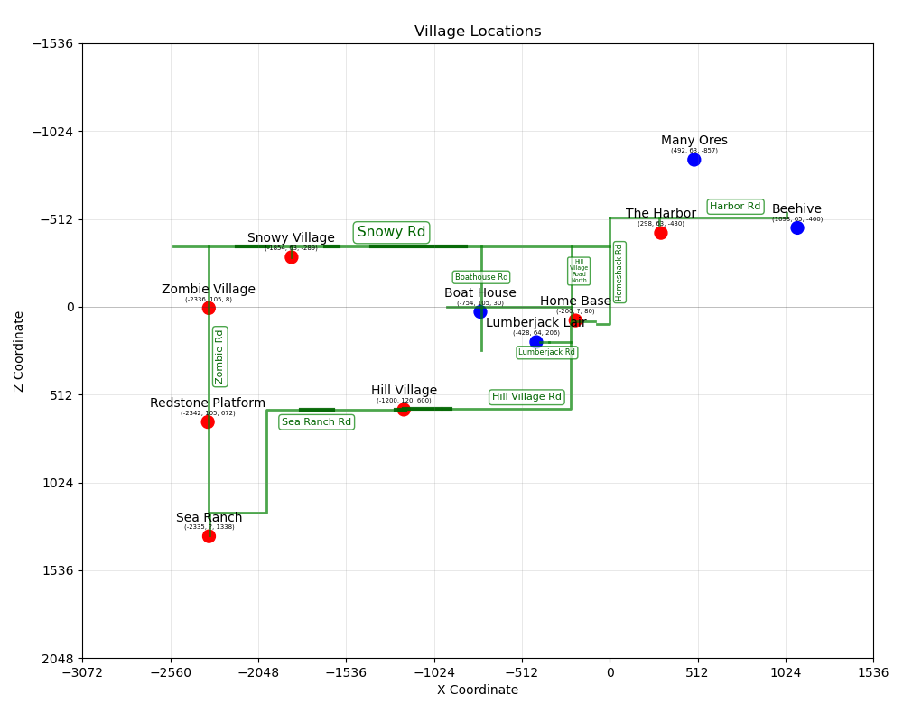

# Minecraft Map

A quick & dirty way to view a set of Minecraft coordinates
as an X-Y graph.

## Features

- Displays North/South/East/West correctly (flips the vertical axis)
- Shows gridlines on multiples of 512 to align with in-game maps
- Overrides matplotlib's tendency to stretch the map to make it look better
- MIT licensed, use it however you like.

## To run:

- Install matplotlib.
  - Fedora: `sudo dnf install python3-matplotlib-gtk4`
- Clone this repo.
- Add your coordiantes to the top of the `Minecraft Map.py` file and delete the examples.
- Run `python "Minecraft Map.py"`
